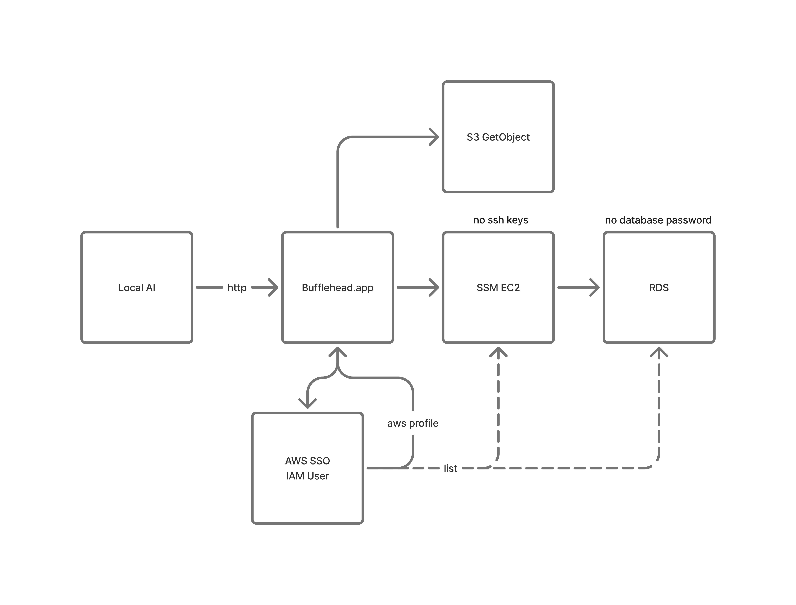

# AWS SSM Gateway

How Bufflehead reaches private AWS data — RDS databases inside a VPC and objects
in S3 — without SSH keys, bastion passwords, or a database password stored
anywhere on disk.

<p align="center">
  
</p>

## The problem

The usual way to query a private RDS instance from a laptop involves a bastion
host, an SSH key, an `ssh -L` incantation, and a database password pasted into a
client. Every one of those is a long-lived secret that has to be issued,
rotated, and revoked, and the SSH key has to be distributed to every machine
that needs access.

Bufflehead replaces all of it with credentials that AWS already issues and
expires on its own: an SSO login for the human, and IAM for everything the app
does on their behalf.

## Design

Every arrow in the diagram above is one of four pieces:

### 1. AWS SSO / IAM — the only login

The user signs in once through AWS IAM Identity Center (SSO). Bufflehead runs
the **OIDC device authorization flow** itself (`internal/aws/auth.go`) rather
than shelling out to the AWS CLI: it registers a client, starts device
authorization, opens the portal URL in the browser, polls for the token, and
writes it to `~/.aws/sso/cache/` in the same format the CLI uses. The result is
a normal named profile in `~/.aws/config`, so the credentials interoperate with
every other AWS tool on the machine.

From that one login Bufflehead can enumerate what the user is entitled to —
`ListSSOAccounts` / `ListSSORoles` to pick an account and role, then
`ListSSMInstances` and `ListRDSInstances` to populate the connection form. That
is the dashed **list** arrow in the diagram: discovery uses the SSO identity, so
there is nothing to type in by hand and nothing to guess.

Credentials expire with the SSO session. Nothing long-lived is written by
Bufflehead.

### 2. SSM EC2 — the tunnel, with no SSH keys

To reach a database in a private subnet, Bufflehead opens an **AWS Systems
Manager port-forwarding session** to a bastion instance
(`internal/aws/ssm_session.go`). SSM's `AWS-StartPortForwardingSessionToRemoteHost`
document forwards a local TCP port through the SSM agent on the instance to
`rds_host:rds_port` — the instance needs no inbound security-group rule, no
public IP, and no `authorized_keys` entry. Access is authorized by the IAM
policy on `ssm:StartSession`, which means it is granted and revoked centrally
like any other IAM permission.

The session-manager plugin is vendored as a **Go library dependency**, not
invoked as an external binary, so there is no `session-manager-plugin` install
step for users and the whole tunnel lives inside the app process.

`TunnelManager` (`internal/aws/tunnel.go`) supervises the session:

- **Reconnect with backoff.** A dropped session is retried up to 10 times with
  exponential backoff (1s → 32s).
- **Instance re-resolution.** If the connection is configured with instance
  *tags* instead of a fixed instance ID, the bastion is re-resolved before each
  reconnect, so a rotating spot instance doesn't break the tunnel.
- **Fail fast when retrying can't help.** An expired SSO login (`IsAuthErrorString`)
  or an ambiguous bastion lookup (`PermanentError`) stops the loop immediately
  and surfaces the reason, instead of burning ten attempts on an error the user
  has to act on.
- **Status is observable.** Every transition reports a human-readable progress
  message that the gateway UI renders live.

### 3. RDS — IAM auth, with no database password

With the tunnel up, Bufflehead connects Postgres over `127.0.0.1:<local_port>`.
When the connection's `auth_mode` is `iam`, there is still no password: it calls
`rdsauth.BuildAuthToken` to mint a short-lived IAM token for the *real* RDS
endpoint and uses that as the password (`internal/db/postgres.go`).

Two details matter here:

- The token is built for the **RDS endpoint**, not for `localhost` — it is a
  signed statement about the database being reached, while the TCP connection
  is made to the tunnel.
- RDS IAM tokens expire after 15 minutes, so a **fresh token is generated before
  each new connection** rather than once at startup. Long-lived sessions and
  reconnects keep working without a re-login.

`sslmode=require` is forced for IAM connections; RDS rejects IAM auth otherwise.

### 4. S3 — bounded object reads for the local AI

The **Local AI → http → Bufflehead.app → S3 GetObject** path in the diagram is
the control API (`internal/control/`). A local agent can ask Bufflehead to fetch
an S3 object, and Bufflehead performs the `GetObject` with the gateway
connection's already-authenticated AWS config — the agent never sees, holds, or
needs AWS credentials of its own.

Two guardrails apply:

- Every control request carries a **bearer key** minted at launch, so other
  local software can't drive the app by blindly POSTing to the port.
- Reads are **range-limited** (10 MB by default, overridable per request) via an
  HTTP `Range` header, so pointing an agent at a multi-gigabyte object can't
  pull the whole thing down.

## Configuration

Connections live in `gateway.yaml` in the platform config directory
(`models.GatewayConfigPath()`), and are normally created through the gateway UI
rather than by hand. The AWS-gateway shape (`GatewayEntry` with the default
empty `kind`) is:

```yaml
sso_start_url: https://your-org.awsapps.com/start
sso_region: us-east-1
gateways:
  - name: prod-analytics
    aws_profile: bufflehead-prod
    aws_region: us-east-1
    # either a fixed bastion...
    instance_id: i-0123456789abcdef0
    # ...or tags, re-resolved on every reconnect (survives spot rotation)
    instance_tags:
      Role: bastion
    rds_host: analytics.cluster-abc123.us-east-1.rds.amazonaws.com
    rds_port: 5432
    local_port: 15432
    db_name: analytics
    db_user: bufflehead_reader
    auth_mode: iam
```

`auth_mode: password` is supported for databases that don't have IAM auth
enabled; the password can be kept out of the file with `db_password_env`.

## What this buys you

| Traditional | Bufflehead |
| --- | --- |
| SSH key on every laptop | Nothing to distribute — IAM policy on `ssm:StartSession` |
| Bastion with an inbound SSH port | No inbound rules, no public IP |
| Database password in a client | 15-minute IAM token, minted per connection |
| `aws sso login` + `ssh -L` + a GUI client | One login in-app |
| Agent needs AWS credentials to read S3 | Agent calls the local, key-gated control API |

Everything above is scoped by the user's own SSO identity — so access follows
the same IAM review and revocation path as the rest of the account, and a
revoked SSO assignment takes effect on the next connection attempt.

## Related code

| Area | File |
| --- | --- |
| SSO device flow, profile/account/role discovery, SSM + RDS listing | `internal/aws/auth.go` |
| SSM port-forwarding session | `internal/aws/ssm_session.go` |
| Tunnel supervision, reconnect, instance re-resolution | `internal/aws/tunnel.go` |
| Postgres connection + RDS IAM token refresh | `internal/db/postgres.go` |
| Connection config schema and storage | `internal/models/gateway.go` |
| Gateway UI (login, connect steps, status) | `internal/ui/gateway_screen.go`, `internal/ui/gateway_connect.go` |
| Control API incl. S3 `GetObject` | `internal/control/`, `internal/ui/app.go` |
